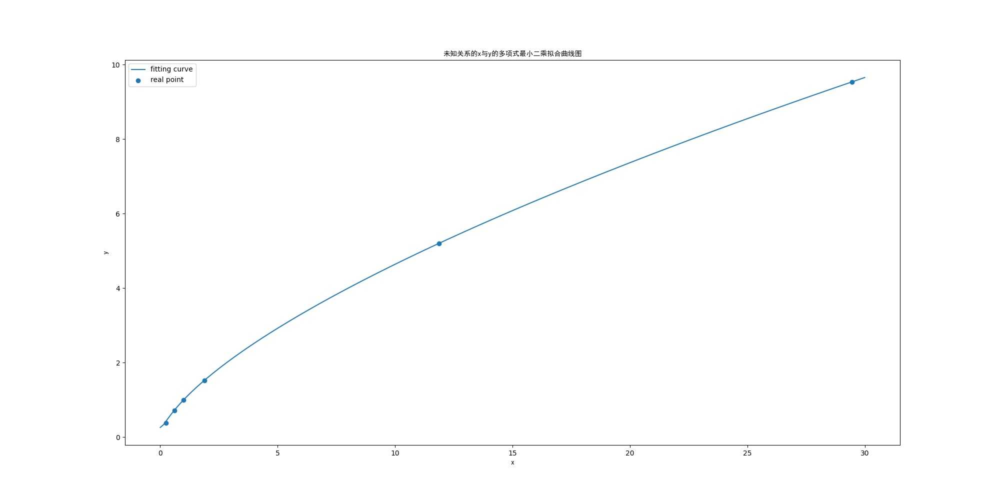

# 思考题

1. 利用 `Python` 采用多项式拟合数据，计算发现，$x^2$ 和 $y^3$ 近似线性，则对$x^2$ 和 $y^3$ 进行线性拟合，解正则方程组得到关系式$y^3 = 0.017678 + 1.000298  x^2$。

    

2. 能用来预测数据，该表达式的$R$方接近1，比较符合现实；预测数据为$\sqrt{\frac{19.19 ^ 3 - 0.017678}{1.000298}} = 84.05183874814466$。

3. 根据 $x^2$ 和 $y^3$ 近似线性，我们猜测该组数据描述的是`开普勒第三定律`，$x$ 为公转周期$T$，$y$ 为半长轴$a$。

