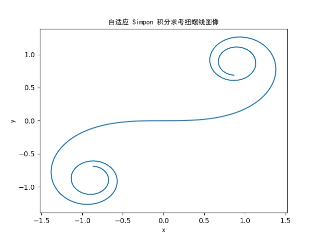

# 第七章 数值微分与数值积分

> By: SpaceSkyNet

## 第 1 题

使用 `Python` 完成自适应 Simpson 数值积分，选择 $200$ 个节点分别对 $x(s)$, $y(s)$ 进行自适应 Simpson 数值积分，得到考纽螺线曲线上点的坐标，得到其图像.

### 自适应 Simpson 数值积分

实际就是选择性对半分治，满足停步准则（$R < eps$）的区间不再分治，其余区间继续分治。

计算公式：$S(a_k, b_k) = \frac{h}{3}(f(a_k) + f(b_k) + 4f(mid))$

停步准则：$R = |\int_{a_k}^{b_k}f(x)dx - S(a_k, mid) − S(mid, b_k)| \approx \frac{1}{15}|S(a_k, mid) + S(mid, b_k) - S(a_k, b_k)| < eps$

其中 $mid = \frac{a_k + b_k}{2}$

参考资料见 `AdaptiveQuadProof.pdf`

