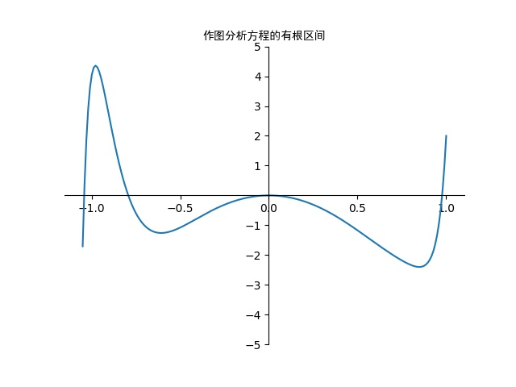

# 第八章 非线性方程及非线性方程组的解法

> By: SpaceSkyNet

## 第 3 题

使用 `Python` 作图分析（见`graph.py`），得到有根区间$(-1.1, -1), (-0.8, -0.7), (-0.01, 0.1), (0.9, 1)$。

再使用 `Python`完成牛顿法和弦截法。

牛顿法（见`main-newton.py`）：
$$
x_{n+1} = x_n - \frac{f(x_n)}{f'(x_n)}
$$

弦截法（见`main-secant.py`）：
$$
x_{n+1} = x_n - \frac{f(x_n)}{f(x_n) - f(x_{n-1})}(x_n - x_{n-1})
$$
